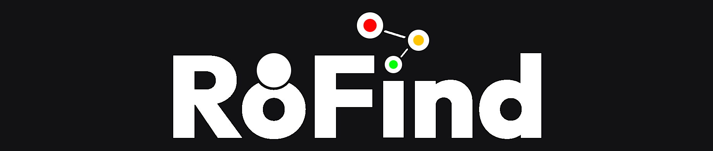

### Terence Montecillo | _KERNL_

I write code for fun — mostly web stuff, scripting, and game dev experiments.
Always picking up something new.

 

  

---

### About
Self-taught, mostly learning by building small things and breaking them.
Spend most of my time between game dev experiments, web projects, and discovering new tools.

---

### Currently
- Working on: RoFind
- Learning: Web & App Development and Security
- Reading / watching: Anything really

---

### Skills

  
| **Languages** | **Web** |
|---|---|
|  |  |
| **Game Dev** | **Backend** |
|  |  |
| **Editor & Tools** | **Operating Systems** |
|  |  |

---

### Projects

**[RoFind](https://ro-find.vercel.app)**

An open-source platform where players recommend, rate, and discover games together. Inspired by Better Discovery - Mariage Sorcière on Roblox.

 

_More projects to come..._

---

### Links
[Portfolio](https://kxrnl.github.io) · [Instagram](https://www.instagram.com/kxrnl.main/) · [Discord](https://www.discord.com/users/489963091019169802)
